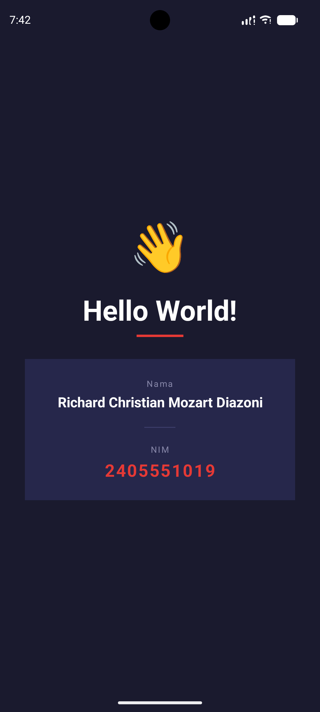

# Android Hello World Kotlin App

## Identitas

| Keterangan | Detail |
|------------|--------|
| **Nama** | Richard Christian Mozart Diazoni |
| **NIM** | 2405551019 |
| **Kelas** | Pemrograman Mobile A |
| **Dosen** | Anak Agung Ketut Agung Cahyawan Wiranatha, S.T., M.T. |

---

## Deskripsi

Project ini merupakan aplikasi Android sederhana yang dibuat menggunakan bahasa pemrograman **Kotlin** di **Android Studio**. Aplikasi ini menampilkan teks **Hello World**, disertai informasi nama dan NIM, serta dilengkapi dengan animasi sederhana untuk meningkatkan tampilan antarmuka.

Tujuan dari pembuatan aplikasi ini adalah untuk memahami dasar-dasar pengembangan aplikasi Android, mulai dari pembuatan project, pengaturan layout, hingga implementasi animasi.

---

## Fitur Utama

- Menampilkan teks **Hello World**
- Menampilkan **Nama** dan **NIM**
- Desain UI sederhana dengan tema gelap *(dark theme)*
- Animasi **fade-in** bertahap pada setiap elemen
- Animasi **scale** pada emoji

---

## Struktur Project

```
app/
├── manifests/
├── kotlin+java/
│   └── MainActivity.kt
└── res/
    └── layout/
        └── activity_main.xml

Gradle Scripts/
├── build.gradle.kts (Project)
├── build.gradle.kts (Module)
└── settings.gradle.kts
```

| File | Fungsi |
|------|--------|
| `MainActivity.kt` | Mengatur logika utama aplikasi dan animasi |
| `activity_main.xml` | Mengatur tampilan antarmuka pengguna (UI) |
| `Gradle Scripts` | Konfigurasi dan proses build project |

---

## Penjelasan Kode

### `MainActivity.kt`
File ini merupakan pusat logika aplikasi yang berfungsi untuk:
- Menghubungkan komponen UI dengan kode menggunakan `findViewById`
- Mengatur animasi **fade-in** secara bertahap pada setiap komponen
- Menambahkan animasi **scale** pada emoji menggunakan `ObjectAnimator`

Animasi bertahap dilakukan dengan memanggil fungsi `fadeIn` pada masing-masing komponen dengan **delay yang berbeda-beda**, sehingga elemen muncul secara berurutan.

### `activity_main.xml`
File ini berfungsi untuk mengatur tampilan aplikasi. Komponen utama yang ada di dalamnya:
- Emoji
- Teks **Hello World**
- Bagian yang menampilkan **Nama** dan **NIM**

Desain menggunakan **latar belakang gelap** dengan warna teks yang kontras dan **tata letak terpusat** agar tampilan lebih rapi dan mudah dibaca.

---

## Screenshot Aplikasi



---

## Cara Menjalankan Aplikasi

1. *Clone* repository ini
2. Buka project menggunakan **Android Studio**
3. Tunggu proses **Gradle Sync** selesai
4. Jalankan emulator melalui **Device Manager**
5. Klik tombol **Run** ▶️

---

## Analisis Teknis

Aplikasi ini tidak hanya menampilkan teks sederhana, tetapi juga mengimplementasikan:
- **Pemisahan antara UI dan logika** — tampilan menggunakan XML, logika menggunakan Kotlin
- **Animasi sederhana** untuk meningkatkan pengalaman pengguna
- **Struktur project standar Android Studio** sehingga mudah dikembangkan lebih lanjut

---

## Kendala yang Ditemui

| Kendala | Keterangan |
|---------|------------|
| Spesifikasi perangkat | Emulator membutuhkan RAM dan CPU yang cukup tinggi |
| Proses build lambat | Gradle sync memakan waktu, terutama saat pertama kali |
| Delay awal | Aplikasi mengalami delay saat pertama kali dijalankan di emulator |

---

## Kesimpulan

Aplikasi ini berhasil memenuhi tujuan sebagai aplikasi dasar **Hello World**. Selain menampilkan teks, aplikasi juga dilengkapi dengan desain antarmuka dan animasi sederhana, sehingga memberikan pemahaman yang lebih baik mengenai dasar pengembangan aplikasi Android menggunakan Kotlin.

---

## Pengembangan Selanjutnya

Beberapa hal yang dapat dikembangkan lebih lanjut:
- Menggunakan **Jetpack Compose** sebagai pendekatan UI modern
- Menambahkan fitur interaksi seperti **button** dan **input pengguna**
- Mengintegrasikan aplikasi dengan **database** atau **API eksternal**
